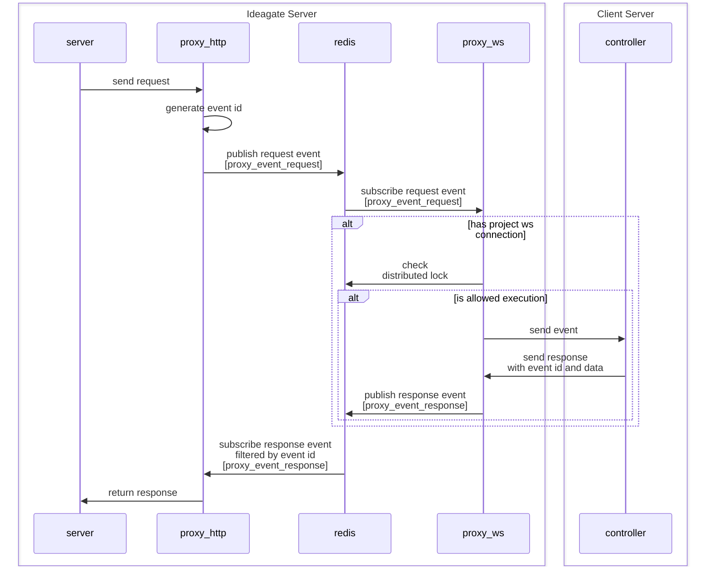

# Ideagate

## Project Structure
```
/backend
│
├── /cmd
│   ├── /control-plane       # Main entry point for the Control Plane service
│   │   └── main.go
│   └── /worker-api          # Main entry point for the Worker API service
│       └── main.go
│
├── /internal                # Private application and domain code
│   ├── /controlplane        # Domain logic specific to Control Plane
│   │   ├── /config          # Configuration for Control Plane
│   │   ├── /domain          # Domain models for Control Plane
│   │   ├── /app             # Application services for Control Plane
│   │   ├── /port            # Interfaces for communication (Input/Output)
│   │   ├── /infrastructure  # Database and other infrastructure connection
│   │   ├── /adapter         # Adapters (Controllers, DB, etc.)
│   │   └── /usecase         # Use case specific business logic
│   │
│   ├── /worker              # Domain logic specific to Worker API
│   │   ├── /config          # Configuration for Worker API
│   │   ├── /domain          # Domain models for Worker API
│   │   ├── /app             # Application services for Worker API
│   │   ├── /port            # Interfaces for communication (Input/Output)
│   │   ├── /infrastructure  # Database and other infrastructure connection
│   │   ├── /adapter         # Adapters (Controllers, DB, etc.)
│   │   └── /usecase         # Use case specific business logic
│   │
│   ├── /shared              # Shared domain logic between Control Plane and Worker
│   │   ├── /domain          # Shared domain models
│   │   ├── /app             # Shared application services
│   │   ├── /adapter         # Shared adapters (DB, Redis, etc.)
│   │   └── /port            # Shared interfaces
│
├── /pkg                     # Publicly available packages (if needed)
│   └── /utils               # Utility functions shared across the project
│
├── /configs                 # Configuration files (env, yaml, etc.)
│
├── /scripts                 # DevOps, CI/CD scripts, and helper scripts
│
├── /docs                    # Project documentation
│
├── /test                    # Test-related files and directories
│   └── /integration         # Integration tests
│
└── go.mod                   # Go module file

```

## Websocket Proxy

### Diagram


### Models
```json5
// Event
{
    "ID": "string",
    "ProjectID": "string",
    "Data": {}
}
```