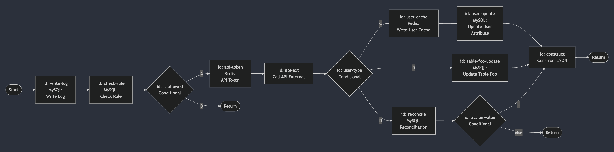

# Example

## Diagram

For example, we have workflow with this diagram:



## Conditions

- `A`: if result from `check-rule` is `true`
- `B`: if result from `check-rule` is `false`, then request is returned
- `C`: if result from `api-ext`, the user type is `new`
- `D`: if result from `api-ext`, the user type is `old`
- `E`: if result from `api-ext`, the user type is `old`, same with `D`
- `F`: if result from `action-3` > 300, then request is returned. But this is bad implementation, because it will stop another concurrent (`user-cache`, `action-1`, and `action-2`)

## Configuration

<details>
  <summary>Example configuration for this workflow in JSON form</summary>

```json5
{
  "Steps": [
    {
      "Id": "request",
      "Type": "start",
      "Variables": {
        "token": { "Value": "{{.Req.Header.Authorization}}" },
        "user_id": { "Value": "{{.Req.Query.user_id}}" }
      }
    },
    {
      "Id": "write-log",
      "Name": "Write Request Log",
      "Type": "mysql",
      "Variables": {
        "user_id": { "Value": "{{.Step.request.Var.user_id}}" }
      },
      "Action": {
        "DataSourceId": "bizhub-staging-mysql",
        "Queries": [
          {
            "Id": "insert",
            "Query": "INSERT INTO log(user_id) VALUES (?)",
            "Parameters": [{ "Value": "{{.Var.user_id}}" }]
          }
        ]
      }
    },
    {
      "Id": "check-rule",
      "Name": "Check Registration Rule",
      "Type": "mysql",
      "Variables": {
        "user_id": { "Value": "{{.Step.request.Var.user_id}}" }
      },
      "Action": {
        "DataSourceId": "bizhub-staging-mysql",
        "Queries": [
          {
            "Id": "select",
            "Query": "SELECT is_allow, message FROM ... WHERE user_id = ?",
            "Parameters": [{ "Value": "{{.Var.user_id}}" }],
            "IsSingleRow": true
          }
        ]
      },
      "Outputs": {
        "is_allow_register": { "Value": "{{.Data.select.is_allow}}" },
        "is_allow_register_msg": { "Value": "{{.Data.select.message}}" }
      }
    },
    {
      "Id": "is-allowed",
      "Name": "Is Register Allowed",
      "Type": "condition",
      "Variables": {
        "is_allow_register": {
          "Value": "{{.Step.check-rule.Out.is_allow_register}}",
          "Type": "bool",
          "Required": true,
          "Default": false
        }
      },
      "Action": {
        "Conditions": [
          {
            "Id": "allow",
            "Logic": "AND",
            "Statements": [
              {
                "Comparison": "==",
                "Value1": { "Value": "{{.Var.is_allow_register}}" },
                "Value2": { "Value": true }
              }
            ]
          },
          {
            "Id": "else"
          }
        ]
      }
    },
    {
      "Id": "api-token",
      "Name": "Get Api Token",
      "Type": "redis",
      "Variables": {
        "user_id": { "Value": "{{.Step.request.Var.user_id}}" }
      },
      "Action": {
        "DataSourceId": "bizhub-staging-redis",
        "Queries": [
          {
            "Id": "token",
            "Query": { "Value": "GET user:token:{{.Var.user_id}}" }
          }
        ]
      },
      "Outputs": {
        "api_key_external": { "Value": "{{.Data.token}}" }
      }
    },
    {
      "Id": "api-ext",
      "Name": "Call API External",
      "Type": "rest",
      "Variables": {
        "token": { "Value": "{{.Step.request.Var.token}}" },
        "user_id": { "Value": "{{.Step.request.Var.user_id}}" }
      },
      "Action": {
        "DataSourceId": "bkn-staging-api",
        "Path": { "Value": "/user/profile?user_id={{.Var.user_id}}" },
        "Method": "GET",
        "Headers": {
          "Authorization": "Bearer {{.Var.token}}"
        }
      },
      "Outputs": {
        "user_type": { "Value": "{{.Data.Body.user_type}}" }
      }
    },
    {
      "Id": "user-type",
      "Name": "User Type Condition",
      "Type": "condition",
      "Variables": {
        "user_type": { "Value": "{{.Step.api-ext.Out.user_type}}" }
      },
      "Action": {
        "Conditions": [
          {
            "Id": "asn",
            "Logic": "AND",
            "Statements": [
              {
                "Comparison": "IN",
                "Value1": { "Value": "{{.Var.user_type}}" },
                "Value2": { "Value": "bkn,pppk,tni" }
              }
            ]
          },
          {
            "Id": "else"
          }
        ]
      }
    },
    {
      "Id": "user-cache",
      "Name": "Write User Cache",
      "Type": "redis",
      "Variables": {
        "user_id": { "Value": "{{.Step.request.Var.user_id}}" },
        "user_type": { "Value": "{{.Step.api-ext.Out.user_type}}" },
        "ttl": { "Value": "3600" }
      },
      "Action": {
        "DataSourceId": "bizhub-staging-redis",
        "Queries": [
          {
            "Id": "token",
            "Query": {
              "Value": "HSET user:{{.Var.user_id}} type {{.Var.user_type}}"
            }
          },
          {
            "Id": "ttl",
            "Query": { "Value": "EXPIRE user:{{.Var.user_id}} {{.Var.ttl}}" }
          }
        ]
      }
    },
    {
      "Id": "user-update",
      "Name": "Update User Attribute",
      "Type": "mysql",
      "Variables": {
        "user_id": { "Value": "{{.Step.request.Var.user_id}}" },
        "user_type": { "Value": "{{.Step.api-ext.Out.user_type}}" }
      },
      "Action": {
        "DataSourceId": "bizhub-staging-mysql",
        "Queries": [
          // Multiple query means this is will run in transaction mode
          {
            "Id": "update-user",
            "Query": "UPDATE user SET `type` = ? WHERE user_id = ?",
            "Parameters": [
              { "Value": "{{.Var.user_type}}" },
              { "Value": "{{.Var.user_id}}" }
            ]
          },
          {
            "Id": "update-user-log",
            "Query": "INSERT INTO user_log(datetime, user_id) VALUES (?,?)",
            "Parameters": [
              { "Value": "NOW()" },
              { "Value": "{{.Var.user_id}}" }
            ]
          }
        ]
      }
    },
    {
      "Id": "table-foo-update",
      "Name": "Update Table Foo",
      "Type": "mysql",
      "Variables": {
        "user_id": { "Value": "{{.Step.request.Var.user_id}}" }
      },
      "Action": {
        "DataSourceId": "bizhub-staging-mysql",
        "Queries": [
          {
            "Id": "update",
            "Query": "UPDATE foo SET success = true WHERE user_id = ?",
            "Parameters": [{ "Value": "{{.Var.user_id}}" }]
          }
        ]
      }
    },
    {
      "Id": "reconcile",
      "Name": "Reconcile",
      "Type": "mysql",
      "Variables": {
        "user_id": { "Value": "{{.Step.request.Var.user_id}}" }
      },
      "Action": {
        "DataSourceId": "bizhub-staging-mysql",
        "Queries": [
          {
            "Id": "select",
            "Query": "SELECT status FROM reconcile WHERE user_id = ?",
            "Parameters": [{ "Value": "{{.Var.user_id}}" }],
            "IsSingleRow": true
          }
        ]
      },
      "Outputs": {
        "status": { "Value": "{{.Data.select.status}}" }
      }
    },
    {
      "Id": "action-value",
      "Name": "Conditional",
      "Type": "condition",
      "Variables": {
        "status": { "Value": "{{.Step.reconcile.Out.status}}" }
      },
      "Action": {
        "Conditions": [
          {
            "Id": "success",
            "Logic": "AND",
            "Statements": [
              {
                "Comparison": "==",
                "Value1": { "Value": "{{.Var.status}}" },
                "Value2": { "Value": "success" }
              }
            ]
          },
          {
            "Id": "else"
          }
        ]
      }
    },
    {
      "Id": "construct",
      "Name": "Construct JSON",
      "Type": "transformerJS",
      "Variables": {
        "user_id": { "Value": "{{.Step.request.Var.user_id}}" },
        "user_type": { "Value": "{{.Step.api-ext.Out.user_type}}" },
        "message": { "Value": "{{.Step.check-rule.Out.is_allow_register_msg}}" }
      },
      "Action": {
        "Script": """
          data = {
            user: {
              "id": vars.user_id,
              "type": vars.user_type
            },
            validation: {
              "is_allow_register_msg": vars.message,
            }
          }
        """
      }
    }
  ],
  "Edges": [
    { "Id": "req-write-log", "Source": ["request"], "Dest": ["write-log"] },
    {
      "Id": "write-log-check-rule",
      "Source": ["write-log"],
      "Dest": ["check-rule"]
    },
    {
      "Id": "check-rule-condition",
      "Source": ["check-rule"],
      "Dest": ["is-allowed"]
    },

    {
      "Id": "is-allowed-api-token",
      "ConditionId": "allow",
      "Source": ["is-allowed"],
      "Dest": ["api-token"]
    },
    {
      "Id": "is-allowed-end",
      "ConditionId": "else",
      "Source": ["is-allowed"],
      "Dest": ["end"]
    },

    { "Id": "api-token-api-ext", "Source": ["api-token"], "Dest": ["api-ext"] },
    { "Id": "api-ext-user-type", "Source": ["api-ext"], "Dest": ["user-type"] },

    {
      "Id": "user-type-user-cache",
      "ConditionId": "asn",
      "Source": ["user-type"],
      "Dest": ["user-cache"]
    },
    {
      "Id": "user-type-end",
      "ConditionId": "else",
      "Source": ["user-type"],
      "Dest": ["table-foo-update", "reconcile"]
    },

    {
      "Id": "user-cache-user-update",
      "Source": ["user-cache"],
      "Dest": ["user-update"]
    },
    {
      "Id": "user-update-construct",
      "Source": ["user-update"],
      "Dest": ["construct"]
    },

    {
      "Id": "table-foo-update-construct",
      "Source": ["table-foo-update"],
      "Dest": ["construct"]
    },

    {
      "Id": "reconcile-action-value",
      "Source": ["reconcile"],
      "Dest": ["action-value"]
    },
    {
      "Id": "action-value-construct",
      "ConditionId": "success",
      "Source": ["action-value"],
      "Dest": ["construct"]
    },
    {
      "Id": "action-value-end",
      "ConditionId": "else",
      "Source": ["action-value"],
      "Dest": ["end"]
    },

    { "Id": "construct-end", "Source": ["construct"], "Dest": ["end"] }
  ]
}

```

</details>
